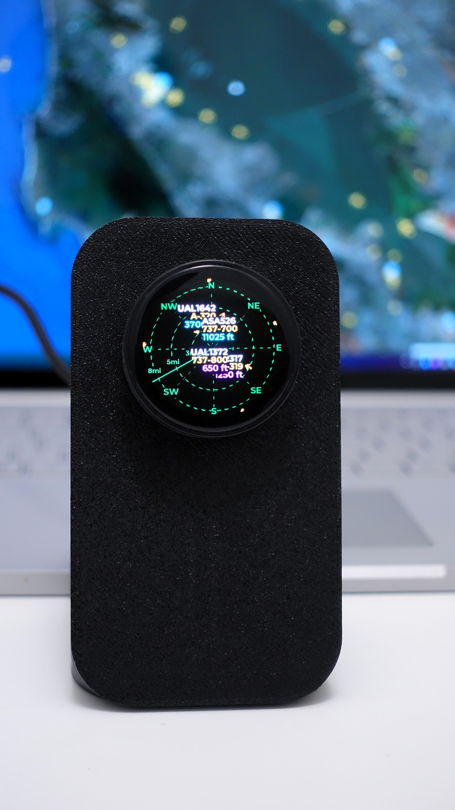

# FlightScnr for LilyGO T-Encoder Pro

<p align="center">

</p>

Open-source firmware that shows **live ADS-B traffic** on a sweeping radar around your preset position. Built for the **[LilyGO T-Encoder Pro](https://www.lilygo.cc/zo4apl)**, inspired by desktop flight-tracking radar gadgets such as **[ESP32-Plane-Radar](https://github.com/MatixYo/ESP32-Plane-Radar)** and **[deskradar](https://github.com/arvis91/deskradar)**.

Firmware is released under **[CC BY-NC-SA 4.0](https://creativecommons.org/licenses/by-nc-sa/4.0/)** (see [LICENSE](LICENSE)) instead of MIT. Permissive MIT licensing on similar projects has made it easy for vendors to ship closed derivatives without keeping firmware open to the community. This license keeps the source shareable for hobbyists and open-source builders while discouraging proprietary takeaways.

**3D-printed enclosure:** [MakerWorld Link](https://makerworld.com/en/models/1964198-lilygo-t-encoder-pro-s3-stand). Licensed separately. See [Enclosure license](#enclosure-license) below.

## Features

- **Sweeping radar:** concentric range rings, compass rose, radar sweep line, top-down **aircraft pips** (heading-aligned), and callsign / type / altitude tags
- **Display range:** 2 / 4 / 6 / 8 mi on the outermost ring. Inner rings show 1/3 and 2/3 of that scale. Knob changes preset.
- **Distance units:** statute miles or kilometers on ring labels and detail readouts
- **Beyond-ring pips:** aircraft outside the active range still appear on the rim
- **Flight detail:** tap a blip or short press the knob for callsign, airline, route, ICAO type, altitude, and speed. Turn the knob to cycle through visible aircraft.
- **Settings:** swipe left from radar for page 1 (network / location) and page 2 (brightness, units, compass rose)
- **Clock:** swipe down from radar for large local time (NTP). Swipe left for UTC offset and 12h/24h format.
- **Web settings:** on your local network at [http://flightscnr.local/](http://flightscnr.local/) (or device IP) for radar center, filters, route API keys, monthly limits, and route-cache download
- **Setup portal:** captive portal on first boot or after knob reset. Wi‑Fi network and password only at [http://4.3.2.1](http://4.3.2.1). Other settings use the live web portal after connecting.
- **Airline & route:** optional API sources to fetch flight details. Vendors are used in the order of: **AirLabs > FlightAware > FR24** (same idea as [plane-tracker-rgb-pi](https://github.com/c0wsaysmoo/plane-tracker-rgb-pi)). One live lookup per callsign, then flash/RAM cache.
- **Background ADS-B:** non-blocking fetch on a FreeRTOS task (~**2 s** via [adsb.fi](https://adsb.fi))
- **Auto reconnect:** STA retries after a short grace period if network drops

## Controls


| Input                | Radar                      | Flight detail | Settings 1/2  | Settings 2/2                       | Clock               | Clock settings          |
| -------------------- | -------------------------- | ------------- | ------------- | ---------------------------------- | ------------------- | ----------------------- |
| **Rotate knob**      | Next range preset          | Next aircraft |               | Change highlighted value           |                     | Adjust UTC offset       |
| **Short press knob** | Open detail (closest)      |               |               | Cycle brightness / units / compass |                     | Cycle timezone / format |
| **Tap screen**       | Open detail (nearest blip) |               |               |                                    |                     |                         |
| **Swipe down**       | Open clock                 |               |               |                                    |                     |                         |
| **Swipe up**         |                            |               |               |                                    | Back to radar       |                         |
| **Swipe left**       | Open settings (page 1)     |               | Open page 2   |                                    | Open clock settings |                         |
| **Swipe right**      |                            | Back to radar | Back to radar | Back to page 1                     |                     | Back to clock           |
| **Hold knob 3 s**    | WiFi reset               | Same          | Same          | Same                               | Same                | Same                    |


**Idle timeout (10 s):** flight detail and both settings pages return to **radar**. Clock settings return to the **clock** (not radar). The clock face has no idle timeout.

Range, distance units, brightness, clock timezone/format, and route API settings persist across reboots.

**Note:** Do not hold the **knob** while powering on. It shares **GPIO 0** with the ESP32-S3 and will enter **USB download / bootloader** mode. Use the **3 s hold** while the app is already running to open the setup portal again.

## First-time setup

1. Power on. If no saved Wi‑Fi (or after a reset), the display shows the setup AP name.
2. Join Wi‑Fi **FlightScnr-AP** on your phone or PC.
3. Open [http://flightscnr.local](http://flightscnr.local) (mDNS) or [http://4.3.2.1](http://4.3.2.1).
4. In the captive portal, choose your desired **Wi‑Fi** SSID and enter the password
5. Save. The device connects to your network and shows the radar. Set radar center, filters, and route APIs at [http://flightscnr.local/](http://flightscnr.local/) once connected.

### Change settings later (without clearing Wi‑Fi settings)

On the local network, open [http://flightscnr.local/](http://flightscnr.local/) or `http://<device-ip>/`. Edit radar center, miles/km, min altitude, range preset, and route API keys/limits, then **Save & reboot**.

The on-device settings page 1 shows **flightscnr.local** and the device IP address when Wi‑Fi is connected.

To reset **Wi‑Fi** and reopen the captive portal, hold the knob **3 s** (clears saved Wi‑Fi only).

## Screens

### Radar

- Up to **64** aircraft per refresh with a non blocking radar sweep
- ADS-B poll about every **2 s**

### Flight detail

- Callsign, airline, route (`ORIG > DEST`), ICAO aircraft type (e.g. `B738`), altitude, ground speed
- Footer: aircraft index, gesture guide

### Settings (1/2 and 2/2)

- **Page 1:** IP, Wi‑Fi SSID, lat/lon, min altitude, web hostname
- **Page 2:** brightness, miles/km, compass rose on/off (knob adjusts highlighted row)
- Footer: gesture guide

### Clock

- Shows time in 12h/24h format , date, UTC offset label.
- Footer: gesture guide

### Clock settings

- Timezone (UTC offset, hours) and 12h/24h format. Knob press cycles focus. Turn adjusts value.
- Footer: gesture guide

## Hardware


| Item          | Details                                                                                                                                |
| ------------- | -------------------------------------------------------------------------------------------------------------------------------------- |
| **Board**     | [LilyGO T-Encoder Pro](https://www.lilygo.cc/zo4apl). ESP32-S3-R8, 16 MB flash, 8 MB OPI PSRAM                                         |
| **Enclosure** | [MakerWorld](https://makerworld.com/en/models/1964198-lilygo-t-encoder-pro-s3-stand). Not in this repo. Terms on the model page apply. |


## Build and flash

Requires [PlatformIO](https://platformio.org/). On Windows, if `pio` is not on PATH:

```bash
python -m platformio run -e tencoder-pro -t upload
python -m platformio device monitor
```

Otherwise:

```bash
pio run -e tencoder-pro -t upload
pio device monitor
```

Each build downloads the latest [tar1090-db](https://github.com/wiedehopf/tar1090-db) aircraft database and regenerates the ICAO type lookup (e.g. `E75L` → Embraer ERJ-170-200). If the download fails, the last cached or committed lookup is used. Refresh manually with `python tools/icao_types_to_header.py`.

### Single merged binary (factory image)

```bash
pio run -e tencoder-pro
pio run -t merge -e tencoder-pro
```

Output: `.pio/build/tencoder-pro/firmware-merged.bin`. For a **full factory flash**, write at offset **0x0** (erases saved Wi‑Fi and settings). Normal updates use the app image at **0x10000** instead (see WebFlasher below).

If upload fails, hold the board **BOOT** button (not the knob), tap reset, and retry.  

### WebFlasher (browser based)

**[FlightScnr WebFlasher](https://yashmulgaonkar.github.io/FlightScnr)** flashes firmware over USB from Chrome or Edge — no PlatformIO required.

1. Connect the T-Encoder Pro via USB.
2. Open WebFlasher, click **Connect**, then **Install**.
3. If needed, hold **BOOT** while connecting.

## Configuration

### Route / Airline APIs (optional)

Sign up for desired tiers with each vendor:


| Service             | Sign up                                                                                                                             |
| ------------------- | ----------------------------------------------------------------------------------------------------------------------------------- |
| AirLabs             | [airlabs.co/signup](https://airlabs.co/signup)                                                                                      |
| FlightAware AeroAPI | [Personal signup](https://www.flightaware.com/aeroapi/signup/personal) · [Pricing](https://www.flightaware.com/commercial/aeroapi/) |
| FlightRadar24       | [fr24api.flightradar24.com](https://fr24api.flightradar24.com/docs/getting-started)                                                 |


Enable providers and paste keys on the **web settings** page. You can enter **multiple keys per provider**, comma-separated (`key1, key2, key3`). When one key reaches its monthly cap, the next key is used before the API calls move on to the next provider.

Route lookups are cached in RAM and on the **~3.4 MB LittleFS** partition as `/route_cache.csv` (saved every ~10 min). **Live route APIs run at most once per callsign** on first sight of an unfamiliar ICAO callsign. Cached and previously looked-up callsigns are not sent to the providers again. Download the CSV from [http://flightscnr.local/](http://flightscnr.local/) under **Route cache**.

**Monthly API limits** apply **per key** and are editable on the web settings page. Counters reset each calendar month when NTP time is valid. Cached callsigns do not count toward limits.

Defaults match typical free tiers (AirLabs 1,000 queries/month. AeroAPI Personal up to $5/month free. ADS-B feeders may get $10). Adjust on the settings page if your plan or pricing differs.

The flash cache holds up to **1500** callsign rows. Oldest entries are replaced when full.

Larger cache compatibility is still a work in progress.

## License

### Firmware license

Original application code, tools, and documentation in this repository are licensed under **[Creative Commons Attribution-NonCommercial-ShareAlike 4.0 International](https://creativecommons.org/licenses/by-nc-sa/4.0/)** ([LICENSE](LICENSE)).

- **Attribution:** credit the author and link to the license when you share or adapt this work.
- **NonCommercial:** you may not use this material for commercial purposes without separate permission.
- **ShareAlike:** adaptations must be released under the same license.

Vendored libraries (`lib/Arduino_GFX`, `lib/SensorLib`, and PlatformIO registry dependencies) remain under **their own licenses** (GPL, MIT, etc.). Combining them into a binary does not re-license those components. Comply with each upstream license when you distribute builds.

### Enclosure license

The optional 3D-printed enclosure is **not** part of this firmware repository. Its digital files and physical prints are governed by the license shown on the linked **MakerWorld** model page. That content is published under a **Standard Digital File License**, which includes terms such as:

> This user content is licensed under a Standard Digital File License.  
> You shall not share, sub-license, sell, rent, host, transfer, or distribute in any way the digital or 3D printed versions of this object, nor any other derivative work of this object in its digital or physical format (including - but not limited to - remixes of this object, and hosting on other digital platforms). The objects may not be used without permission in any way whatsoever in which you charge money, or collect fees.

Always read the full license on MakerWorld before downloading, printing, or sharing the enclosure design.
